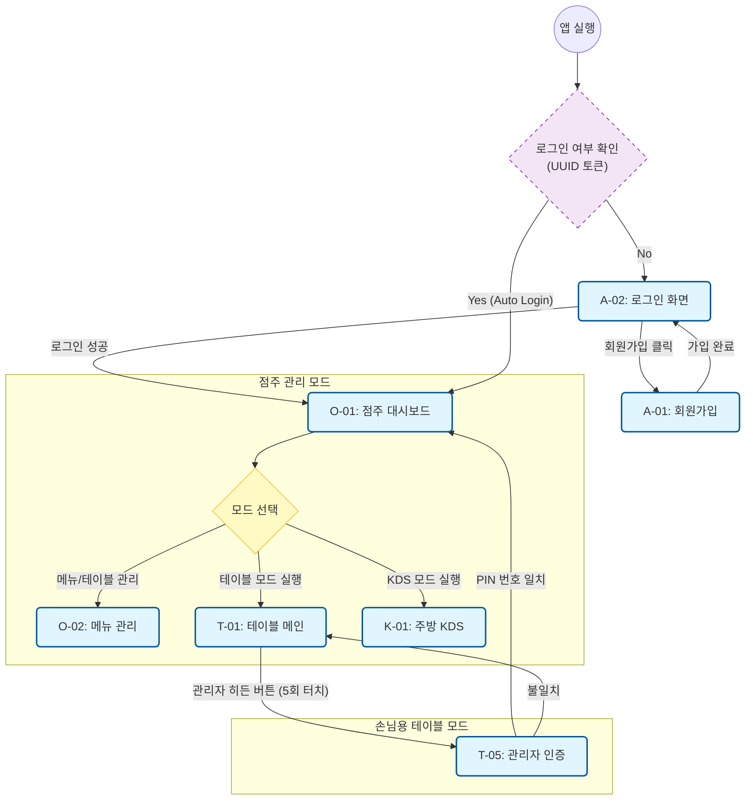
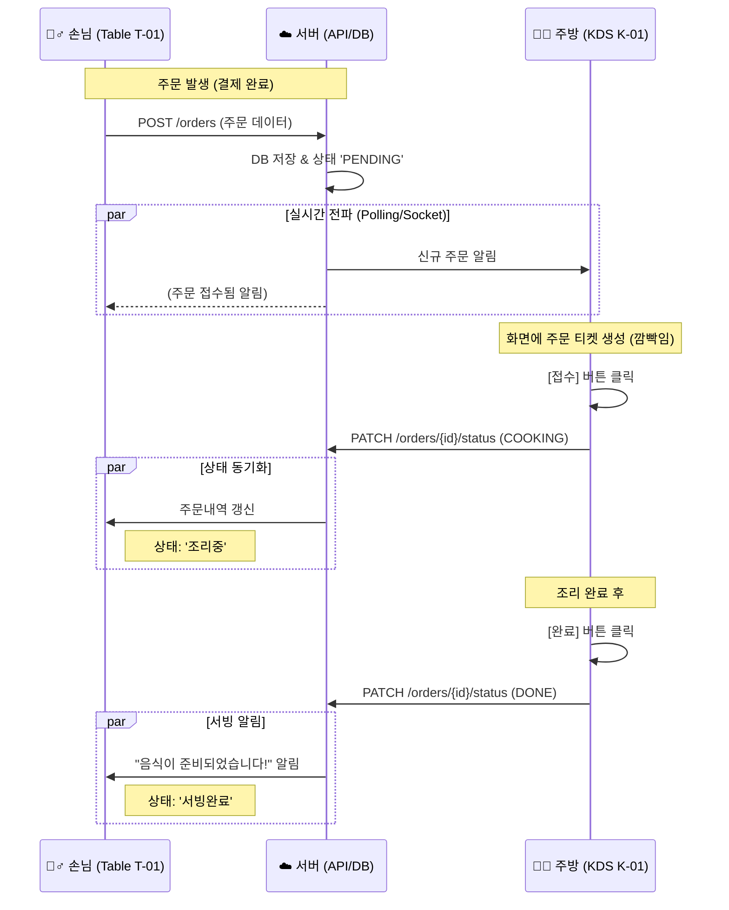

네, 대화가 길어지면 놓칠 수 있죠! 흐름상 **05번**이 데이터베이스 명세서였으므로, 그 바로 앞단계인 **04번 문서**는 화면의 흐름과 로직을 정의했던 **[비즈니스 로직 및 워크플로우 명세서]**입니다.

아까 Mermaid로 작성해 드렸던 **3가지 핵심 흐름도(진입, 주문, 주방)**를 문서화하여 정리해 드립니다.

이 내용을 **`04_business_logic_workflow.md`** 파일로 저장하시면 됩니다.

---

```markdown
# [기획] 비즈니스 로직 및 워크플로우 명세서

> **문서 번호:** 04_business_logic_workflow.md
> **작성 일자:** 2025.01.10
> **내용:** 사용자(점주/손님/주방)의 행동 흐름과 시스템의 분기 처리 로직 정의.
> **도구:** Mermaid Flowchart & Sequence Diagram

---

## 1. 전체 시스템 진입 및 모드 전환 (System Entry)
점주가 로그인 후, 해당 태블릿을 **어떤 용도(테이블용, 주방용, 관리용)**로 쓸지 결정하는 흐름입니다.



---

## 2. 손님 주문 및 결제 프로세스 (Customer Order)

손님이 메뉴를 고르고, 옵션을 선택하여 결제까지 완료하는 핵심 수익 발생 흐름입니다.

```mermaid
flowchart TD
    %% 스타일 정의
    classDef screen fill:#e8f5e9,stroke:#2e7d32,stroke-width:2px,rx:5,ry:5;
    classDef popup fill:#fff3e0,stroke:#ef6c00,stroke-width:2px,rx:5,ry:5;
    classDef process fill:#f3e5f5,stroke:#7b1fa2,stroke-width:1px;

    %% 메인 흐름
    T01["T-01: 메인 주문판<br/>(ScrollSpy)"]:::screen -->|메뉴 클릭| CheckSoldOut{"품절 여부"}:::process
    
    CheckSoldOut -- "판매중" --> T02["T-02: 옵션 선택 팝업"]:::popup
    CheckSoldOut -- "품절됨" --> Toast1("토스트 알림:<br/>품절된 메뉴입니다"):::process

    %% 옵션 선택
    T02 -->|"옵션 선택 & 담기"| CartLogic{"유효성 검사<br/>(필수옵션 체크)"}:::process
    CartLogic -- "Pass" --> T01_Update["장바구니 갱신"]:::screen
    CartLogic -- "Fail" --> T02
    
    %% 장바구니 및 결제
    T01_Update -->|"주문하기 버튼"| T03["T-03: 주문 및 결제 확인"]:::screen
    
    subgraph Payment [결제 로직 (Toss Payments)]
        T03 --> PayType{"결제 방식 선택<br/>(Toggle)"}:::process
        PayType -- "일괄 결제" --> PayAll["전체 금액 결제"]:::process
        PayType -- "개별 결제" --> PaySplit["체크한 메뉴만 결제"]:::process
        
        PayAll & PaySplit --> PG["PG사 결제창 호출"]:::process
    end

    PG -- "결제 승인" --> OrderComplete(("주문 완료<br/>서버 전송"))
    PG -- "실패/취소" --> T03

```

---

## 3. 주방 주문 접수 및 동기화 (Kitchen Fulfillment)

주문이 들어왔을 때 서버를 거쳐 주방(KDS)에 표시되고, 조리 상태가 손님 화면과 동기화되는 과정입니다.



```

```