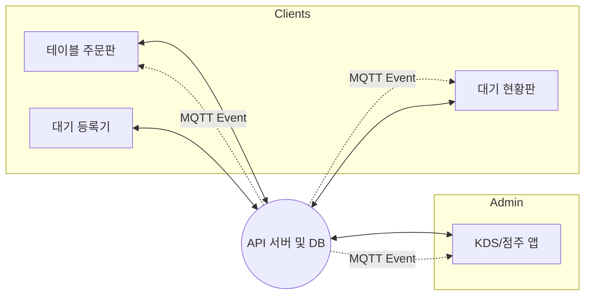

# 테이블오더 및 대기열 통합 시스템 기획서 (v3.0)

## 1. 개요
본 문서는 테이블오더 시스템과 매장 대기열 관리 시스템을 통합하여 실무 관점에서 설명하기 위한 기획 문서이다. 카레 전문점(**우마이 카레**)이라는 구체적인 업종 페르소나를 기반으로 시스템의 전체 구조, 역할 분리, 주요 흐름을 정의한다. 본 기획은 단순 주문 기능을 넘어 상세 옵션 처리, 실시간 대기 호출, 원가 기반 수익성 분석 및 외부 날씨 데이터 연동을 통한 운영 인사이트 제공을 핵심으로 한다.

---

## 2. 기획 목표
1. **커스터마이징 주문 재현**: 카레 맵기 조절(필수), 토핑 추가(선택) 등 복잡한 메뉴 옵션 로직과 가격 합산 흐름을 명확히 재현한다.
2. **통합 대기열 관리**: 입구 접수부터 현황판 호출까지 이어지는 대기열 라이프사이클을 통해 매장 유입 단계부터 디지털 전환(DX)을 구현한다.
3. **수익 중심 정산**: 메뉴 및 옵션별 **원가(Cost)** 관리를 통해 단순 매출이 아닌 **실제 순이익** 기반의 운영 리포트를 제공한다.
4. **외부 데이터 활용**: 날씨 API(OpenWeatherMap)를 연동하여 날씨와 메뉴 판매량 간의 상관관계를 분석하는 기능을 제시한다.
5. **실시간 운영 환경**: MQTT를 활용하여 주문, 상태 변경, 대기 호출 알림이 지연 없이 전파되는 환경을 설계한다.

---

## 3. 운영 주체 및 역할 정의

### 3-1. 점주(점포 운영자)
- 사업자등록번호 단위의 점포 운영 주체.
- 메뉴(카레/토핑) 구성, 판매가 및 **원가** 설정, 테이블 및 대기열 운영 정책 관리자.
- 날씨별 판매 통계 및 순이익 데이터를 확인하여 매장을 최적화하는 운영 주체.

### 3-2. 주방 및 매장 현장(KDS/Wait Staff)
- 주문 접수, 조리 상태 관리 및 대기 고객 호출/입장 처리 수행.
- 본 기획에서는 점주 앱 내부의 KDS 및 대기 관리 화면을 통해 해당 역할을 수행한다.

### 3-3. 손님(Guest)
- **대기 고객**: 매장 입구 기기(W-01)에서 정보를 입력하고 현황판(W-02)을 통해 순서를 확인한다.
- **주문 고객**: 테이블 단말(T-01)을 통해 카레 옵션을 커스텀하여 주문 및 결제를 수행한다.

---

## 4. 시스템 구성(역할·화면 단위)

### 4-1. 점주 앱(운영·관리)
1. **회원가입/로그인**: 사업자번호 기반 인증. **최초 접속 시 오늘 날씨 정보(ID, Icon) 수집 트리거(방식 B)** 작동.
2. **대시보드(O-01)**: 실시간 매출, **순이익(매출-원가)** 요약 및 오늘의 날씨 정보 표시.
3. **메뉴/옵션 관리(O-02, O-03)**: 카레 메뉴 및 토핑 등록 시 판매가(Price)와 원가(Cost) 동시 관리.
4. **대기 관리(O-07)**: 실시간 대기 명단 확인, 호출(현황판 전파), 입장/취소 처리.
5. **통계 리포트**: 날씨별 인기 메뉴 및 기간별 수익 분석 데이터 제공.

### 4-2. 손님용 메뉴 화면(T-01 ~ T-03)
1. **메인 주문판**: 카레 카테고리별 메뉴 탐색 및 홍보 배너 노출.
2. **옵션 선택(T-02)**: 맵기 조절(필수), 토핑 추가(선택) 기능 및 합산 금액 실시간 표시.
3. **장바구니/결제**: 최종 내역 확인 및 토스페이먼츠 결제 연동.

### 4-3. 대기열 시스템 화면(W-01, W-02)
1. **대기 등록 화면(W-01)**: 매장 입구 비치. 성함, 연락처, 인원 입력 및 예상 대기 시간 안내.
2. **대기 현황판 화면(W-02)**: 매장 내부 노출. **현재 입장 번호 강조(깜빡임)** 및 대기 리스트 실시간 표시.

### 4-4. 주방용 KDS 화면(K-01)
- 신규 주문 발생 시 메뉴명과 선택된 상세 옵션(맵기, 토핑) 정보가 포함된 티켓 생성.
- 조리 상태(접수/조리중/완료) 변경 시 관련 데이터 서버 반영 및 MQTT 전파.

---

## 5. 전체 시스템 구조

### 구조 개요
- 서버는 모든 주문, 결제, 대기, 날씨 데이터의 **Source of Truth** 역할을 수행한다.
- 실시간 통신은 **MQTT** 이벤트를 통해 다수의 기기(테이블, 주방, 현황판)에 동시에 전파된다.

---

## 6. 핵심 비즈니스 로직

### 6-1. 수익 및 정산 관리
- **원가 기반 정산**: 점주가 직접 재료비를 반영한 원가를 입력하여 실제 마진율 관리 가능.
- **스냅샷 정책**: 주문 시점의 판매가 및 원가를 별도로 저장하여 가격 변동 시에도 과거 정산 데이터 유지.

### 6-2. 대기열 지능화
- **예상 시간 계산**: '매장 평균 식사 시간' 설정을 기반으로 대기 고객에게 논리적인 대기 시간 제공.
- **실시간 호출**: MQTT를 통한 현황판 즉시 동기화로 고객 이탈 방지 및 운영 효율화.

### 6-3. 날씨 기반 통계 (방식 B)
- **수집 트리거**: 점주 앱 로그인 또는 대시보드 진입 시 서버에 당일 날씨 요청. 데이터가 없으면 API 호출 후 저장.
- **데이터 활용**: 수집된 날씨 ID와 Icon을 주문 데이터와 연결하여 날씨별 판매 통계 도출.

---

## 7. 주요 처리 흐름

### 7-1. 대기 및 입장 흐름
1. (고객) 입구 기기(W-01) 접수 -> (서버) 대기번호 및 예상시간 생성.
2. (점주) 대기 명단 확인 후 [호출] 클릭 -> (MQTT) 현황판(W-02)에 호출 알림 전파.
3. (직원) 고객 확인 후 [입장] 처리 -> 테이블 활성화.

### 7-2. 주문 처리 흐름 (카레 특화)
1. (고객) 메뉴 선택 및 **필수 옵션(맵기)** 검증 통과 후 장바구니 담기.
2. (고객) 결제 완료 -> (서버) **당일 날씨 및 메뉴 원가 스냅샷** 포함 주문 저장.
3. (주방) KDS 티켓 확인 및 조리 완료 처리.

---

## 8. 사업자번호 가입 및 검증
- 점포는 사업자등록번호를 기반으로 가입하며, 가입 시점에는 형식 검증을 우선 수행한다.
- 운영 단계에서 관리자 콘솔을 통해 공식 API 검증을 수행하고 결과에 따라 운영 제한이 가능하도록 설계한다.

---

## 9. 기획 정리
본 기획서는 테이블오더 시스템의 구조를 기반으로 **카레 전문점의 상세 운영 시나리오**를 완벽히 재현하기 위해 작성되었다. 업종 특화 메뉴/옵션 체계, 대기열-주문-주방-정산을 잇는 통합 시스템 설계, 날씨와 원가 정보를 결합한 고도화된 매출 분석을 통해 실제 매장 운영과 흡사한 디지털 시스템의 표준을 제시한다.
