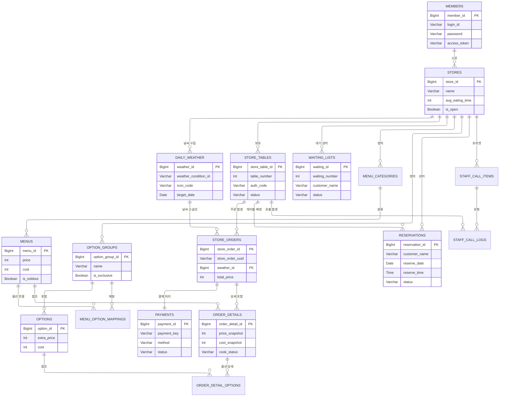

# [설계] 최종 통합 ERD (v4.0)

> - **문서 파일명:** 05_final_integrated_erd.md. 
> - **작성 일자:** 2026.01.12. 
> - **버전:** v4.0 (Full Integration: 07번 문서 명세 100% 반영). 
> - **문서 설명:** 카레 전문점 시나리오 및 매장 통합 관리 시스템의 물리적 ERD 시각화.  

---

## 1. ERD 시각화 (Mermaid Diagram)

---

## 2. 핵심 관계 설계 요약

### 2.1 거래 기록 보존 (Snapshot)
- `ORDER_DETAILS` 및 `ORDER_DETAIL_OPTIONS`: 메뉴의 가격이나 원가가 나중에 수정되더라도 과거 매출/이익 통계가 변하지 않도록 `price_snapshot`과 `cost_snapshot`을 저장합니다.

### 2.2 실무형 통계 연결 (Weather Link)
- `DAILY_WEATHER`와 `STORE_ORDERS`: 모든 주문은 발생 시점의 일일 날씨 ID를 FK로 가집니다. 이를 통해 "비 오는 날 가장 많이 팔린 카레" 등의 통계 분석이 데이터베이스 수준에서 즉시 가능합니다.

### 2.3 옵션 유연성 (Associative Mapping)
- `MENU_OPTION_MAPPINGS`: 메뉴와 옵션 그룹을 다대다(N:M)로 연결하여, '맵기 단계' 옵션 그룹을 여러 종류의 카레 메뉴에 재사용할 수 있도록 설계했습니다.

### 2.4 매장 통합 운영 (Waiting & Call)
- `WAITING_LISTS` (대기)와 `STAFF_CALL_LOGS` (호출): 테이블오더 시스템에 통합되어 점주 앱 하나로 매장의 모든 유입과 서비스를 관리할 수 있는 기반을 제공합니다.

---
