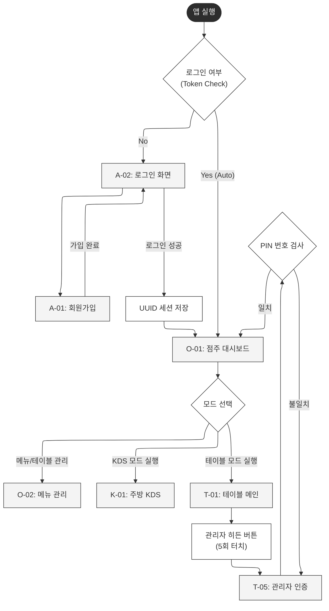
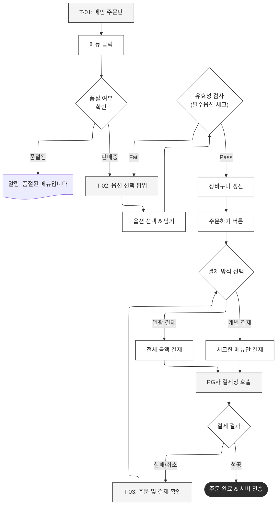
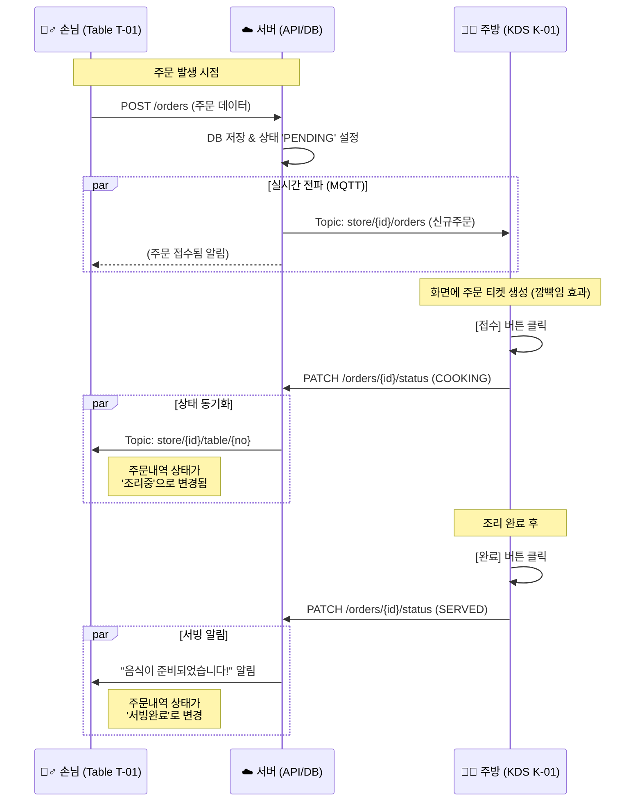

# [상세] 비즈니스 로직 및 워크플로우 명세서 (v2.2)

> - **문서 파일명:** 04_business_logic_workflow_detail.md
> - **작성 일자:** 2026.01.10
> - **버전:** v2.2 (KDS 시퀀스 다이어그램 및 상세 로직 통합 완료)
> - **참조 문서:** 03_full_screen_definition.md (화면), 05_final_integrated_erd.md (DB)
> - **문서 목적:** 개발자가 구현해야 할 시스템의 상세 동작 조건(Validation), 분기 처리(Branching), 데이터 흐름(Data Flow) 정의

---

## 1. 시스템 진입 및 모드 전환 (System Entry)

앱 실행 시 초기 진입 로직과, 점주 모드/테이블 모드 간의 전환 프로세스를 정의합니다.

### 1.1 워크플로우 (Flowchart)

### 1.2 상세 처리 로직 (Logic Specs)

**1) 자동 로그인 (Auto Login)**
* **조건:** 앱 실행 시 `SecureStorage` (또는 `SharedPreferences`)에 `access_token` 존재 여부 확인.
* **성공:** 토큰 유효성 API 검증 통과 시 `O-01(점주 메인)`으로 즉시 이동 (Splash 생략 가능).
* **실패:** 토큰 없음 or 만료 시 `A-02(로그인 화면)` 출력 및 내부 저장소 초기화.

**2) 관리자 히든 버튼 (Admin Exit)**
* **목적:** 손님이 임의로 앱을 종료하거나 점주 화면으로 이탈하는 것을 방지.
* **Trigger:** 화면 로고 영역 5회 연속 터치 (또는 우측 상단 3초 롱프레스).
* **검증:** `TABLES.auth_code` 또는 점주 비밀번호와 일치하는지 로컬/서버 검증.

---

## 2. 손님 주문 및 결제 프로세스 (Order & Payment)

테이블 모드에서 손님의 메뉴 선택, 옵션 검증, PG 결제까지의 핵심 트랜잭션 흐름입니다.

### 2.1 워크플로우 (Flowchart)

### 2.2 상세 처리 로직 (Logic Specs)

**1) 품절 체크 (Stock Check)**
* **시점:** 메뉴 클릭 시점(1차), 주문하기 버튼 클릭 시점(2차).
* **동작:** 서버의 최신 상태와 동기화된 로컬 캐시 확인. 품절 시 Toast 알림 출력 후 진입 차단.

**2) 옵션 유효성 검사 (Option Validation)**
* **필수(Mandatory):** `min_select > 0`인 옵션 그룹에서 선택 개수가 부족하면 "담기" 버튼 비활성화.
* **최대(Limit):** `max_select` 개수를 초과하여 선택 시도 시 시각적 피드백(진동/알림) 후 선택 막음.

**3) PG 결제 연동 (Payment)**
* **Toss Payments:**
    * `order_uuid` 생성: `ORDERS` 테이블에 INSERT 전 미리 UUID 생성.
    * `successUrl`: 결제 성공 시 호출될 클라이언트 딥링크 또는 콜백 함수.
* **트랜잭션:** 결제 승인(Payment Key 수신)과 동시에 `ORDERS` 상태를 PAID로 업데이트하고 `ORDER_DETAILS` 생성.

---

## 3. 주방 KDS 주문 처리 (Real-time Order Processing)

주방(KDS) 화면과 서버 간의 API 호출 및 실시간 동기화(MQTT) 흐름입니다.

### 3.1 시퀀스 다이어그램 (Sequence Diagram)

### 3.2 처리 단계 및 동기화

* **신규(Pending):** `ORDERS` 생성 직후 상태. KDS에서 알림음 발생.
* **조리중(Cooking):** 주방 직원이 [접수] 버튼 터치 시 변경.
* **완료(Done):** 조리 완료 후 [호출/완료] 버튼 터치 시 변경. 서빙 직원(또는 손님 태블릿)에게 알림 전송.
* **기술 스택:** WebSocket 또는 MQTT를 사용하여 테이블과 주방 간의 상태를 Delay < 500ms 이내로 동기화.

---

## 4. 예외 및 에러 처리 (Exception Handling)

| 상황 (Context) | 에러 코드 | 사용자 메시지 (UI) | 처리 로직 |
| :--- | :--- | :--- | :--- |
| **네트워크 끊김** | `NET_ERR` | "네트워크 연결이 불안정합니다. 잠시 후 다시 시도해주세요." | 요청 큐(Queue)에 저장 후 재연결 시 자동 재전송 (Retry Policy) |
| **결제 실패** | `PG_FAIL` | "카드 승인이 거절되었습니다. 잔액을 확인해주세요." | 결제창 닫고 장바구니 화면 유지 (재결제 유도) |
| **동시성 문제** | `STOCK_ERR` | "주문 도중 품절된 메뉴가 있습니다." | 품절된 메뉴만 장바구니에서 자동 삭제 후 알림 |
| **인증 만료** | `AUTH_EXP` | "로그인 세션이 만료되었습니다." | 로그인 화면(A-02)으로 강제 이동 및 토큰 삭제 |

---