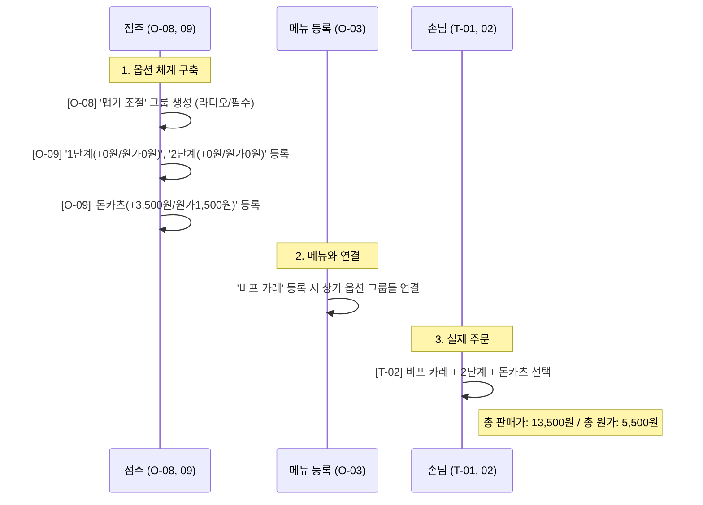

# [설계] 통합 화면 설계서 (v3.1)

**프로젝트 통합 버전:** v3.1  
**화면 개수:** 총 18개 화면 (계정 2, 점주 9, 테이블 5, 대기 2, 주방 1)  
**핵심 변경 사항:** 옵션 그룹 관리(O-08) 및 개별 옵션 등록(O-09) 화면 추가

---

## 1. 화면 목록 (Screen List)

기획서의 기능을 UI 화면 단위로 매핑한 목록입니다.

| 분류 | ID | 화면명 | 핵심 기능 |
| :--- | :--- | :--- | :--- |
| **계정** | **A-01** | 점주 회원가입 | 사업자번호 형식 검증, 계정 생성 |
| | **A-02** | 점주 로그인 | UUID 토큰 발급, 자동로그인, [날씨 수집 트리거] |
| **점주** | **O-01** | 점주 메인(대시보드) | 매출/순이익 요약, 오늘의 날씨 노출, 모드 전환 |
| | **O-02** | 메뉴 관리(목록) | 카테고리별 메뉴 리스트, 품절/숨김 제어 |
| | **O-03** | 메뉴 등록(상세) | 이미지, 판매가, 원가 입력, [옵션 그룹 연결] |
| | **O-04** | 배너 관리 | 홍보용 이미지 등록 및 노출 설정 |
| | **O-05** | 테이블 관리 | 전체 좌석 수 설정, 기기 인증 PIN 확인 |
| | **O-06** | 문의하기 | 시스템 관리자 대상 1:1 메시지 |
| | **O-07** | 대기 관리 | 실시간 대기 명단 확인, [호출], [입장] 처리 |
| | **O-08** | **옵션 그룹 관리** | 옵션 그룹(맵기 단계, 토핑 등) 생성 및 선택 방식 설정 |
| | **O-09** | **상세 옵션 등록** | 개별 옵션명, 추가금, **옵션 원가(Cost)** 등록 |
| **테이블** | **T-01** | 메인 주문판 | 카테고리(카레/토핑/음료), 배너 슬라이드 |
| | **T-02** | 옵션 상세 | 맵기 단계(필수), 토핑 추가(선택) 커스텀 |
| | **T-03** | 장바구니/결제 | 주문 내역 확인, PG 결제(토스페이먼츠) 호출 |
| | **T-04** | 직원 호출 | 물, 반찬, 앞치마 등 호출 프리셋 |
| | **T-05** | 관리자 인증 | [보안] 점주 모드 복귀용 PIN 입력 창 |
| **대기** | **W-01** | 대기 등록 | 입구용: 고객 성함, 연락처, 인원 입력/발권 |
| | **W-02** | 대기 현황판 | 매장용: 현재 호출 번호 강조 및 대기 리스트 노출 |
| **주방** | **K-01** | KDS 메인 | 주문 티켓(맵기/토핑 상세 포함) 확인 및 상태 변경 |

---

## 2. 화면별 상세 명세 (Detailed Specs)

### [Group O] 점주 앱 - 운영/관리 (Owner)

**O-03. 메뉴 등록/수정 (Form)**
*   **Input:** 이미지, 카테고리, 메뉴명, 설명, 판매가, 원가.
*   **추가 기능:** 현재 등록된 **옵션 그룹(`O-08`) 목록** 중 이 메뉴에 적용할 그룹을 체크박스로 선택 (예: '비프 카레' 메뉴에 '맵기 조절' 그룹과 '튀김 토핑' 그룹을 연결).

**O-08. 옵션 그룹 관리 (Option Group)**
*   **UI:** 등록된 옵션 그룹 리스트 (예: 맵기 조절, 토핑 추가, 음료 사이즈).
*   **Action:** 
    *   [그룹 생성]: 그룹명 입력 및 선택 방식 설정.
    *   **선택 방식:** '하나만 선택(라디오)' 또는 '여러 개 선택(체크박스)'.
    *   **필수 여부:** 주문 시 반드시 선택해야 하는지 여부(필수/선택).

**O-09. 상세 옵션 등록 (Option Detail)**
*   **UI:** 특정 그룹 내에 포함될 개별 아이템 등록.
*   **Input:** 
    *   옵션명: (예: 1단계 매운맛, 돈카츠 추가).
    *   추가 판매가: (예: 0원, +3,500원).
    *   **옵션 원가(Cost):** (예: 0원, 1,500원) -> 순이익 계산에 합산됨.

---

### [Group T] 손님용 테이블 메뉴판 (Table)

**T-02. 옵션 상세 (카레 커스텀)**
*   **Logic:** `O-08`에서 설정한 그룹의 방식에 따라 UI 구성.
    *   '맵기 조절' 그룹: 필수 선택이므로 미선택 시 [담기] 버튼 비활성화.
    *   '토핑 추가' 그룹: 여러 개 선택 가능, 선택 시마다 하단 총 금액에 실시간 반영.

---

## 3. 핵심 시나리오 워크플로우 (Scenario)

