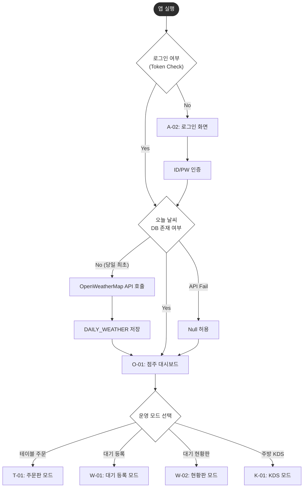
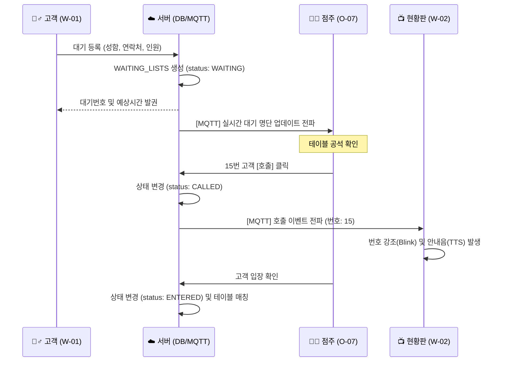
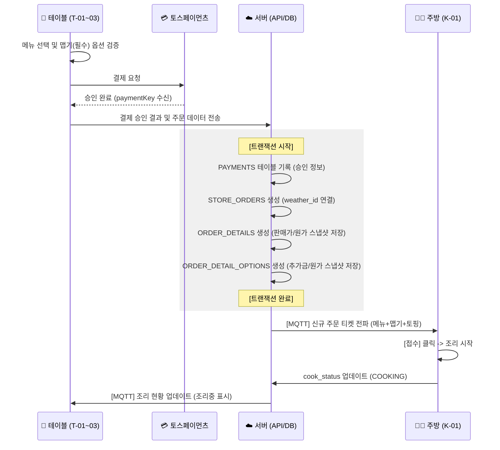

# [상세] 비즈니스 로직 및 워크플로우 명세서 (v4.0)

> - **문서 파일명:** 04_business_logic_workflow_detail.md. 
> - **버전:** v4.0 (Full Integration: 모든 다이어그램 및 정밀 로직 포함). 
> - **참조 문서:** 03_full_screen_definition.md (v3.1), 07_database_schema_spec.md (v4.0). 
> - **문서 목적:** 카레 전문점의 유입부터 정산까지 전 과정의 상세 동작 및 데이터 흐름 정의.  

---

## 1. 시스템 진입 및 모드 전환 (System Entry & Mode)

앱 실행 시의 인증과 **날씨 수집 방식 B**, 그리고 운영 모드 전환 로직입니다.

### 1.1 워크플로우 (Flowchart)

---

## 2. 대기열 및 호출 프로세스 (Waiting & Call)

입구 접수부터 매장 내 현황판 호출까지의 실시간 연동 흐름입니다.

### 2.1 대기열 시퀀스 (Sequence Diagram)

---

## 3. 주문, 결제 및 KDS 처리 (Order, Pay & KDS)

카레 옵션 검증, **결제 스냅샷(판매가/원가)** 저장 및 주방 전송 흐름입니다.

### 3.1 주문 및 결제 시퀀스 (Sequence Diagram)

---

## 4. 상세 비즈니스 로직 규격

| 구분 | 항목 | 상세 내용 및 조건 |
| :--- | :--- | :--- |
| **날씨 연동** | 수집 데이터 | OpenWeatherMap의 `weather_condition_id`와 `icon_code`만 저장하여 통계 효율성 확보. |
| **수익 분석** | 원가 스냅샷 | 메뉴/옵션의 마스터 가격이 변해도 과거 순이익 계산에 영향이 없도록 주문 상세 테이블에 `cost_snapshot` 필수 저장. |
| **대기 관리** | 예상 시간 | `(WAITING 상태 팀 수 / 총 테이블 수) * avg_eating_time`으로 자동 산출. |
| **직원 호출** | 호출 로직 | 테이블별 고유 ID와 호출 항목(`call_item_id`)을 MQTT 메시지에 담아 주방/점주 앱에 실시간 팝업 노출. |

---

## 5. 정산 및 통계 계산

- **당일 총 매출** = `SUM(STORE_ORDERS.total_price)`
- **당일 총 순이익** = `총 매출` - `(SUM(ORDER_DETAILS.cost_snapshot) + SUM(ORDER_DETAIL_OPTIONS.cost_snapshot))`
- **날씨 통계** = `DAILY_WEATHER`와 `STORE_ORDERS`를 `weather_id`로 조인하여 날씨군별 판매 랭킹 집계.

---

## 6. 예외 및 에러 처리

| 상황 | 에러 코드 | 처리 로직 |
| :--- | :--- | :--- |
| **결제 승인 후 서버 통신 장애** | `PAY_SYNC_ERR` | `store_order_uuid`를 대조하여 PG 승인은 되었으나 주문서가 없는 건을 대조하여 복구. |
| **주문 도중 품절 발생** | `STOCK_OUT` | 결제창 진입 전 최종 재고 체크 수행 후 에러 메시지 노출. |
| **날씨 API 장애** | `WEATHER_FAIL` | 에러 무시 후 `weather_id`를 Null로 처리하여 주문 서비스는 정상 유지. |
