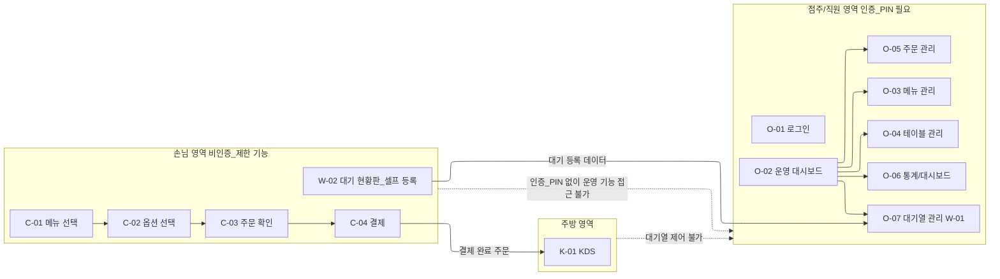

# 화면 설계서 (V04 · 내용 갱신)

본 문서는 **02\_시스템\_기획서\_V04\_재작성.md**를 기준으로 작성된 V04 화면 설계서이며,   
기존 화면 명칭(O-01 \~ K-01)은 **모두 유지**한 채, 운영 기준·책임·권한 정의를 최신 정책에 맞게 갱신한다.

본 문서는 UI 시안 문서가 아니라, **화면 단위 책임과 접근 권한을 고정하기 위한 설계 문서**다.

---

## 1. 화면 설계 기본 원칙

### 1.1 단일 책임 원칙

- 하나의 화면은 하나의 역할만 가진다.
- 화면은 다른 화면의 책임을 대리하지 않는다.

### 1.2 명시적 조작 원칙

- 자동 호출, 자동 입장, 자동 상태 변경은 존재하지 않는다.
- 모든 상태 변화는 점주 또는 직원의 명시적 조작으로만 발생한다.

### 1.3 일일 운영 기준 원칙

- 모든 화면은 **금일 운영 데이터**를 기준으로 동작한다.
- 전일 대기 데이터는 다음날 점주 앱 진입 시점에 정리된 상태로 시작한다.

---

## 2. 점주 / 직원용 운영 화면

### O-01. 점주 로그인 화면

- 점주 계정 인증
- 운영 모드 진입의 시작점

---

### O-02. 점주 메인 화면 (운영 대시보드)

- 금일 매장 상태 요약
  - 사용 중 테이블 수
  - 활성 대기 팀 수
- 주요 운영 화면으로 이동

---

### O-03. 메뉴 관리 화면

- 메뉴 등록 / 수정 / 비활성화
- 가격 및 원가 관리
- 옵션 그룹 연결 관리

---

### O-04. 테이블 관리 화면

- 테이블 수 설정
- 테이블 상태 확인 (사용중 / 비어있음)

---

### O-05. 주문 관리 화면

- 진행 중 주문 목록 조회
- 결제 상태 확인

---

### O-06. 통계 / 대시보드 화면

- 매출 / 원가 / 순이익 통계
- 날씨 기반 통계
- 대기열 운영 지표

---

### O-07. 대기열 관리 화면 (W-01)

> 대기열 운영의 중심 화면

#### 주요 기능

- 금일 대기 리스트 조회
- 다음 호출 / 특정 번호 호출
- 재호출 / 건너뛰기 / 노쇼 처리
- 대기 모드 ON / OFF

#### 운영 기준

- 본 화면은 **금일 운영 대기 데이터만 관리**한다.
- 전일 미처리 대기는 앱 진입 시 이미 정리된 상태다.
- 자동 호출 및 자동 상태 변경은 존재하지 않는다.

#### 접근 정책

- 점주 또는 직원만 접근 가능
- 로그인 상태 또는 PIN 인증 필요

---

## 3. 손님용 대기열 화면

### W-02. 대기 현황판 / 셀프 등록 화면

> 손님이 접근 가능한 유일한 대기열 관련 화면

#### 표시 정보

- 현재 대기 팀 수 (금일 기준)
- 예상 대기 시간 (참고용)
- 최근 호출 번호

#### 입력 기능

- 이름 입력
- 전화번호 입력 (필수)
- 인원 수 입력
- 대기 등록 버튼

#### 동작 규칙

- 매장 만석 여부와 관계없이 등록 가능
- 예상 대기 시간은 참고 정보이며 입장을 보장하지 않는다.
- 관리 기능 접근 불가

---

## 4. 손님용 주문 화면

### C-01. 메뉴 선택 화면

- 메뉴 목록 조회
- 옵션 선택 진입

---

### C-02. 옵션 선택 화면

- 필수 옵션 / 선택 옵션 구분
- 가격 즉시 반영

---

### C-03. 주문 확인 화면

- 주문 내역 요약
- 주문 확정

---

### C-04. 결제 화면

- 결제 수단 선택
- 결제 진행

---

## 5. 주방용 화면

### K-01. KDS 화면

- 결제 완료 주문 표시
- 메뉴 단위 조리 목록
- 옵션 정보 표시

---

## 6. 화면 설계 원칙 요약

- 한 화면 = 하나의 책임
- 자동 처리 대신 명시적 조작
- 손님 화면은 단순, 점주 화면은 제어 중심

---

## 7. 화면 책임 / 권한 분리 다이어그램 (Mermaid)

---

본 문서는 **V04 화면 설계의 기준 문서**이며, 이후 UX/UI 설계는 본 문서를 전제로 한다.

