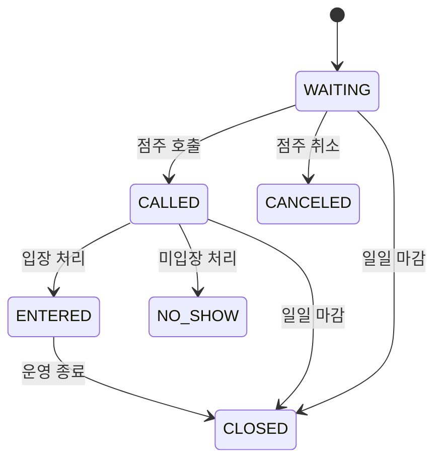

# 비즈니스 로직 설계서 (V04 · 내용 갱신)

본 문서는 **02\_시스템\_기획서\_V04\_재작성.md**, **03\_화면\_설계서\_V04.md**를 기준으로,  
V04 시스템에서 동작하는 핵심 비즈니스 로직과 상태 전이 규칙을 최신 운영 정책에 맞게 갱신한다.  

본 문서는 구현 코드가 아닌, **운영·데이터·상태 변화의 기준을 고정하기 위한 로직 설계 문서**다.

---

## 1. 비즈니스 로직 설계 기본 원칙

### 1.1 명시적 조작 원칙

- 시스템은 손님을 자동으로 호출하지 않는다.
- 시스템은 입장을 자동으로 확정하지 않는다.
- 모든 상태 변화는 **점주 또는 직원의 명시적 조작**으로만 발생한다.

### 1.2 참고 정보 분리 원칙

- 예상 대기 시간, 통계 수치는 **운영 판단 참고용 정보**다.
- 로직 분기나 자동 처리 조건으로 사용하지 않는다.

### 1.3 일일 운영 기준 원칙

- 자정(00:00)은 **운영 마감 기준 시각**이다.
- 별도의 백그라운드 배치 작업은 존재하지 않는다.
- 전일 미처리 데이터는 **다음날 점주 앱 진입 시점에 선조회 후 정리**된다.

---

## 2. 대기열(Waiting) 비즈니스 로직

### 2.1 대기 등록 로직

**트리거**

- 손님이 W-02 화면에서 대기 등록을 수행

**처리 규칙**

1. 전화번호 입력 필수 검증
2. 활성 대기 중복 체크
   - 조건: 동일 전화번호 AND status IN (WAITING, CALLED)
3. 중복 존재 시 등록 불가
4. 대기 번호(waiting\_no) 발급
5. status = WAITING 으로 생성

---

### 2.2 대기 상태 모델

- 모든 상태 전이는 점주/직원 조작으로만 발생한다.
- 자동 호출/자동 입장은 존재하지 않는다.

---

### 2.3 대기 호출 로직

- 호출은 O-07(대기열 관리 화면)에서만 가능하다.
- 기본 호출 대상은 WAITING 상태 중 가장 오래된 항목이다.
- 특정 번호 호출도 허용한다.

---

### 2.4 일일 마감 정리 로직 (Startup Cleanup)

**트리거**

- 점주 앱 로그인 또는 점주 메인 화면 진입 시

**대상**

- 전일(created\_at 기준) 대기 데이터 중
  - status IN (WAITING, CALLED)

**처리**

- status = CLOSED 로 전환
- closed\_at 기록

> 본 처리는 자동 운영이 아닌, **운영 시작 전 데이터 정합을 위한 정리 절차**다.

---

## 3. 주문(Order) 비즈니스 로직

### 3.1 주문 생성

- 주문은 테이블 기준으로 생성된다.
- 대기열 존재 여부는 주문 생성의 선행 조건이 아니다.

### 3.2 주문 항목 구성

- 하나의 주문은 여러 ORDER\_ITEM을 포함할 수 있다.
- ORDER\_ITEM은 OPTION을 포함할 수 있다.

---

## 4. 결제(Payment) 비즈니스 로직

### 4.1 결제 스냅샷 원칙

- 결제 시점에 가격과 원가를 스냅샷으로 확정한다.
- 이후 메뉴/옵션 변경은 기존 결제 데이터에 영향을 주지 않는다.

### 4.2 대기열과 결제의 관계

- 결제는 대기 상태와 직접적인 연동 로직을 갖지 않는다.
- 필요 시 통계 목적으로 waiting\_id를 참조할 수 있다(Nullable).

---

## 5. 통계 및 외부 데이터 로직

### 5.1 날씨 데이터 수집

- 점주 앱 로그인 시 당일 날씨 데이터를 수집한다.
- 수집된 날씨 정보는 주문과 연결될 수 있다(통계용).

### 5.2 통계 집계 기준

- 모든 통계는 **확정된 결제 스냅샷**을 기준으로 집계한다.
- 예상 값이나 진행 중 데이터는 통계에 포함되지 않는다.

---

본 문서는 **V04 비즈니스 로직의 기준 문서**이며, 이후 구현은 본 문서를 위반하지 않는다.

