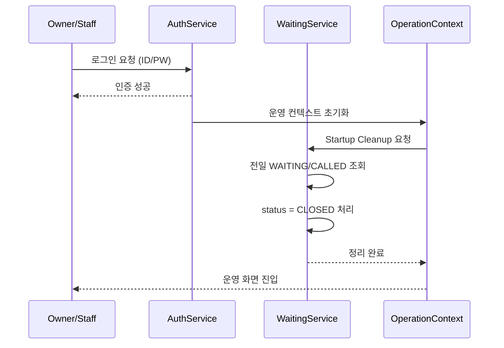

# 인증 아키텍처 명세서 (V04 · 내용 갱신)

본 문서는 **02_시스템_기획서_V04_재작성.md**, **03_화면_설계서_V04.md**, **04_비즈니스_로직_V04.md**, **05_통합_ERD_V04.md**를 기준으로,  
V04 시스템의 인증(Authentication)·권한(Authorization)·운영 진입 흐름을 명확히 정의한다.  

본 문서는 로그인 UI가 아닌, **"누가 언제 어떤 권한으로 어떤 로직을 트리거할 수 있는가"**를 고정하기 위한 아키텍처 문서다.

---

## 1. 인증 아키텍처 설계 원칙

### 1.1 역할 기반 접근 제어(RBAC)

- 모든 화면은 **역할(Role)** 기반으로 접근이 제한된다.
- 역할은 인증 이후에만 판별된다.

### 1.2 화면 보호 우선 원칙

- 손님 화면은 비인증 상태로만 접근 가능하다.
- 점주/직원 화면은 인증 또는 PIN을 반드시 요구한다.

### 1.3 운영 트리거 분리 원칙

- 인증은 단순 접근 제어 수단이다.
- 특정 비즈니스 로직(예: Startup Cleanup)은 **인증 성공 시점의 후행 트리거**로만 동작한다.

---

## 2. 사용자 역할 정의

### 2.1 OWNER (점주)

- 매장 전체 설정 및 운영 권한
- 모든 운영 화면 접근 가능 (O-01 ~ O-07)

### 2.2 STAFF (직원)

- 제한된 운영 권한
- 대기열 관리, 주문 관리 등 지정된 화면 접근 가능

### 2.3 CUSTOMER (손님)

- 인증 없음
- 대기 등록(W-02), 주문(C-01~C-04)만 접근 가능

---

## 3. 인증 수단 정의

### 3.1 계정 기반 로그인

- 대상: OWNER / STAFF
- 방식: ID + Password

### 3.2 PIN 기반 보호 모드

- 대상: 매장 단말
- 용도:
  - 손님 화면 → 점주 화면 전환
  - 운영 화면 이탈 방지

---

## 4. 인증 흐름과 Startup Cleanup 트리거

### 4.1 핵심 개념

- Startup Cleanup은 **백그라운드 배치 작업이 아니다**.
- 인증 성공 또는 운영 화면 진입이라는 **명시적 이벤트**에 의해 트리거된다.

---

### 4.2 인증 + Startup Cleanup 시퀀스 (Mermaid)

---

## 5. 화면 접근 제어 규칙

### 5.1 점주/직원 화면

- O-01 로그인 이후 접근 가능
- 세션 유지 또는 PIN 인증 필요

### 5.2 손님 화면

- 인증 절차 없음
- 운영 화면 직접 접근 불가

---

## 6. 인증 실패 및 예외 처리

- 인증 실패 시 운영 컨텍스트는 생성되지 않는다.
- Startup Cleanup은 실행되지 않는다.
- 손님 화면에는 어떠한 운영 데이터도 노출되지 않는다.

---

## 7. 인증 관련 엔티티 연관 (ERD 관점)

- STAFF → STORES (N:1)
- STAFF.role → 권한 판별 기준
- 인증 자체는 WAITING / ORDER 데이터와 직접 결합되지 않는다.

---

## 8. 인증 아키텍처 요약

- 인증은 접근 제어 역할만 수행한다.
- 운영 로직은 인증 "이후"에만 트리거된다.
- Startup Cleanup은 인증 흐름에 포함된 **운영 초기화 절차**다.

---

본 문서는 **V04 인증 아키텍처의 기준 문서**이며, 이후 구현은 본 문서를 위반하지 않는다.