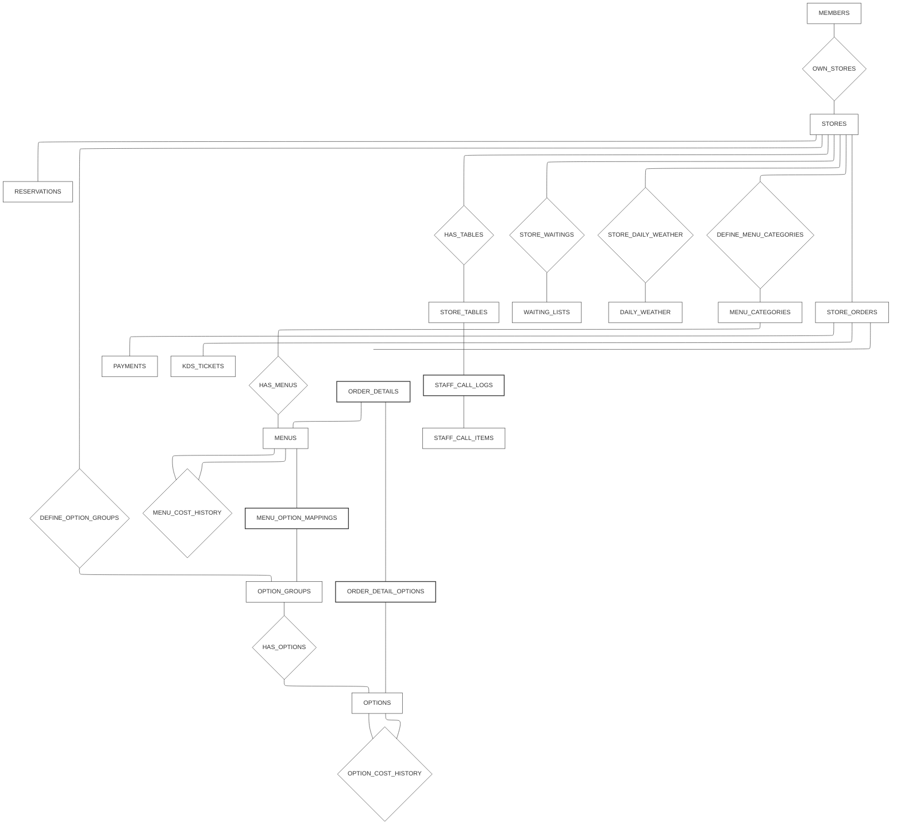

# 05\_통합\_ERD\_V06

> 본 문서는 **07\_DB\_상세\_명세\_V06 (full)** 을 단일 기준(Source of Truth)으로 하여 **개념 ERD(Chen) + 관계 구현 테이블(Implementation)** 을 Mermaid로 재현한다.
>
> - Chen 기준: **연관 엔티티(Associative Entity)는 N****:M**** 해소 전용**
> - 본 프로젝트는 Chen 정합을 위해 **Relationship도 구현 테이블로 내려** 관리한다.
> - 모든 Relationship 구현 테이블은 `created_at`을 가진다.

---

## 0. 다이어그램 구성

- **A. 개념 ERD (Chen 근사 표현 / Flowchart)**
  - 엔티티(사각형) + 관계(다이아몬드) + N\:M 해소(연관 엔티티 사각형)
- **B. 구현 ERD (erDiagram)**
  - 실제 테이블 관계를 “관계선” 중심으로 표현

---

## A) 개념 ERD (Chen 근사 표현)

> Mermaid는 Chen 전용 문법이 없으므로 `flowchart`로 **근사 표현**한다.
>
> 표기 규칙
>
> - **[엔티티]**: 사각형
> - **(관계)**: 다이아몬드
> - **[연관 엔티티]**: 사각형 (※ N\:M 해소 전용)

### A-1. Chen 관점 핵심 메모

- `MENU_OPTION_MAPPINGS`, `ORDER_DETAILS`, `ORDER_DETAIL_OPTIONS`, `STAFF_CALL_LOGS`만 **연관 엔티티(N****:M**** 해소)**
- `owns/has/defines/logs/has_cost_history`는 **관계(Relationship)** 이며, 구현에서는 별도 관계 테이블로 내려간다.
- 대기열(WAITING\_LISTS)은 **STORE\_TABLES와 직접 연결하지 않는다**.

---

## B) 구현 ERD (테이블 기준, Mermaid erDiagram)

> 아래 ERD는 07 기준 테이블을 그대로 사용한다. `Relationship Implementation Table`들도 모두 테이블로 존재하므로, 관계선을 포함해 표기한다.

```mermaid
erDiagram
    %% ============================
    %% ENTITY TABLES
    %% ============================
    MEMBERS ||--o{ OWN_STORES : OWN_STORES
    STORES  ||--o{ OWN_STORES : OWN_STORES

    STORES ||--o{ HAS_TABLES : HAS_TABLES
    STORE_TABLES ||--o{ HAS_TABLES : HAS_TABLES

    STORES ||--o{ DEFINE_MENU_CATEGORIES : DEFINE_MENU_CATEGORIES
    MENU_CATEGORIES ||--o{ DEFINE_MENU_CATEGORIES : DEFINE_MENU_CATEGORIES

    STORES ||--o{ DEFINE_OPTION_GROUPS : DEFINE_OPTION_GROUPS
    OPTION_GROUPS ||--o{ DEFINE_OPTION_GROUPS : DEFINE_OPTION_GROUPS

    STORES ||--o{ STORE_DAILY_WEATHER : STORE_DAILY_WEATHER
    DAILY_WEATHER ||--o{ STORE_DAILY_WEATHER : STORE_DAILY_WEATHER

    STORES ||--o{ STORE_WAITINGS : STORE_WAITINGS
    WAITING_LISTS ||--o{ STORE_WAITINGS : STORE_WAITINGS

    MENU_CATEGORIES ||--o{ MENUS : HAS_MENUS
    OPTION_GROUPS ||--o{ OPTIONS : HAS_OPTIONS

    %% ============================
    %% N:M 해소(ASSOCIATIVE)
    %% ============================
    MENUS ||--o{ MENU_OPTION_MAPPINGS : MENU_OPTION_MAPPINGS
    OPTION_GROUPS ||--o{ MENU_OPTION_MAPPINGS : MENU_OPTION_MAPPINGS

    STORES ||--o{ STORE_ORDERS : STORE_ORDERS

    STORE_ORDERS ||--o{ ORDER_DETAILS : ORDER_DETAILS
    MENUS ||--o{ ORDER_DETAILS : ORDER_DETAILS

    ORDER_DETAILS ||--o{ ORDER_DETAIL_OPTIONS : ORDER_DETAIL_OPTIONS
    OPTIONS ||--o{ ORDER_DETAIL_OPTIONS : ORDER_DETAIL_OPTIONS

    %% ============================
    %% 결제 / KDS (개념 연결 유지)
    %% ============================
    STORE_ORDERS ||--o{ PAYMENTS : PAYMENTS
    STORE_ORDERS ||--o{ KDS_TICKETS : KDS_TICKETS

    %% ============================
    %% 호출 / 예약
    %% ============================
    STORES ||--o{ STAFF_CALL_ITEMS : STAFF_CALL_ITEMS
    STORE_TABLES ||--o{ STAFF_CALL_LOGS : STAFF_CALL_LOGS
    STAFF_CALL_ITEMS ||--o{ STAFF_CALL_LOGS : STAFF_CALL_LOGS

    STORES ||--o{ RESERVATIONS : RESERVATIONS

    %% ============================
    %% 원가 이력(관계 구현 테이블)
    %% ============================
    MENUS ||--o{ MENU_COST_HISTORY : MENU_COST_HISTORY
    OPTIONS ||--o{ OPTION_COST_HISTORY : OPTION_COST_HISTORY
```

### B-1. 구현 ERD 관점 핵심 메모

- `OWN_STORES / HAS_TABLES / DEFINE_* / STORE_*`는 Chen 관계를 **구현 테이블로 내린 결과**다.
- `created_at`은 모든 관계 구현 테이블에 포함된다(07 기준).

---

## 9. 체크리스트 (07 정합)

-

---

> 다음 단계(보류): 05의 다이어그램을 1) Chen만, 2) Implementation만 요구자 제출 목적에 맞게 분리/압축하는 버전도 생성 가능.

