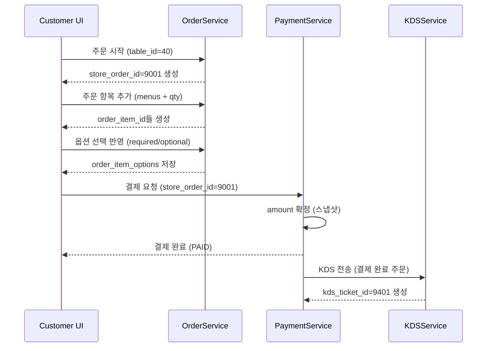

# 주문→결제→KDS 데이터 흐름 예시 (V04)

본 문서는 V04 설계(02~07)를 바탕으로, **손님 주문 → 결제 → KDS 전송**까지의 데이터 흐름을
단 한 장에서 이해할 수 있도록 **예시 시나리오 + 더미 데이터 + 단계별 테이블 반영**으로 정리한 문서다.

> 참고: 대기열(Waiting)은 주문의 필수 선행 조건이 아니며, 본 예시는 "테이블 착석 후 주문" 흐름을 기준으로 한다.

---

## 0. 예시 시나리오

- 매장: 우마이 카레
- 테이블: 4번 테이블 (table_no = 4)
- 손님: 1팀(3명이 각자 메뉴 1개씩 주문)
- 주문: 총 3개 메뉴, 각 메뉴별 옵션 포함
- 결제: 1회 일괄 결제
- KDS: 결제 완료 시점에 주문이 KDS로 전송

---

## 1. 더미 마스터 데이터

### 1.1 STORES

| store_id | name |
|---:|---|
| 1 | 우마이 카레 |

### 1.2 TABLES

| table_id | store_id | table_no | capacity |
|---:|---:|---:|---:|
| 40 | 1 | 4 | 4 |

### 1.3 MENUS

| menu_id | store_id | name | price |
|---:|---:|---|---:|
| 101 | 1 | 돈까스 카레 | 11000 |
| 102 | 1 | 치킨 카레 | 10000 |
| 103 | 1 | 새우 카레 | 12000 |

### 1.4 OPTION_GROUPS

- 필수 옵션: 맵기 조절 (필수)
- 선택 옵션: 토핑 추가 (선택)

| option_group_id | store_id | name | required |
|---:|---:|---|:---:|
| 201 | 1 | 맵기 조절 | Y |
| 202 | 1 | 토핑 추가 | N |

### 1.5 OPTIONS

| option_id | option_group_id | name | price |
|---:|---:|---|---:|
| 301 | 201 | 순한맛 | 0 |
| 302 | 201 | 보통맛 | 0 |
| 303 | 201 | 매운맛 | 0 |
| 311 | 202 | 계란 추가 | 1000 |
| 312 | 202 | 치즈 추가 | 1500 |
| 313 | 202 | 새우 추가 | 2000 |

---

## 2. 주문 생성 단계 (STORE_ORDERS)

손님이 테이블에서 주문을 시작하면, 우선 "주문 헤더"가 생성된다.

### 2.1 STORE_ORDERS 생성

| store_order_id | store_id | table_id | waiting_id | status | created_at |
|---:|---:|---:|---:|---|---|
| 9001 | 1 | 40 | NULL | OPEN | 2026-01-12 12:10:00 |

> waiting_id는 통계용 선택 참조이며, 본 예시에서는 사용하지 않는다.

---

## 3. 주문 항목 추가 단계 (ORDER_ITEMS)

### 3.1 ORDER_ITEMS

| order_item_id | store_order_id | menu_id | qty |
|---:|---:|---:|---:|
| 9101 | 9001 | 101 | 1 |
| 9102 | 9001 | 102 | 1 |
| 9103 | 9001 | 103 | 1 |

---

## 4. 옵션 반영 단계 (ORDER_ITEM_OPTIONS)

각 메뉴는 **필수 옵션(맵기)** 을 반드시 1개 선택해야 하며,
선택 옵션(토핑)은 0개 이상 추가할 수 있다.

### 4.1 ORDER_ITEM_OPTIONS

| order_item_option_id | order_item_id | option_id |
|---:|---:|---:|
| 9201 | 9101 | 302 |
| 9202 | 9101 | 312 |
| 9203 | 9102 | 303 |
| 9204 | 9102 | 311 |
| 9205 | 9103 | 301 |
| 9206 | 9103 | 313 |

---

## 5. 결제 단계 (PAYMENTS)

결제 시점에 결제 금액이 확정되며, 결제 완료가 되어야 KDS 전송이 시작된다.

### 5.1 금액 계산(예시)

- 돈까스 카레 11,000 + 치즈 1,500 = 12,500
- 치킨 카레 10,000 + 계란 1,000 = 11,000
- 새우 카레 12,000 + 새우추가 2,000 = 14,000

합계 = 12,500 + 11,000 + 14,000 = 37,500

### 5.2 PAYMENTS 생성

| payment_id | store_order_id | amount | status | created_at |
|---:|---:|---:|---|---|
| 9301 | 9001 | 37500 | PAID | 2026-01-12 12:15:30 |

> V04 기준: 결제는 스냅샷 원칙을 따르며, 결제 완료 시점의 값이 통계 기준이 된다.

---

## 6. KDS 전송 단계 (KDS_TICKETS)

결제 완료 주문은 주방 KDS에 "조리 티켓" 형태로 전송된다.

### 6.1 KDS_TICKETS 생성 (예시)

| kds_ticket_id | store_id | store_order_id | status | created_at |
|---:|---:|---:|---|---|
| 9401 | 1 | 9001 | NEW | 2026-01-12 12:15:31 |

---

## 7. 전체 흐름 시퀀스 다이어그램 (Mermaid)

---

## 8. 체크 포인트 (V04 기준)

- 주문은 TABLES 기준으로 생성된다.
- 옵션은 ORDER_ITEM_OPTIONS로 분리 저장한다.
- 결제가 완료되어야 KDS 전송이 발생한다.
- 대기열(WAITING)은 이 흐름의 필수 선행 조건이 아니다.

---

본 문서는 V04 기준으로 팀원이 "주문→결제→KDS" 데이터 흐름을 빠르게 이해하기 위한 예시 문서다.

