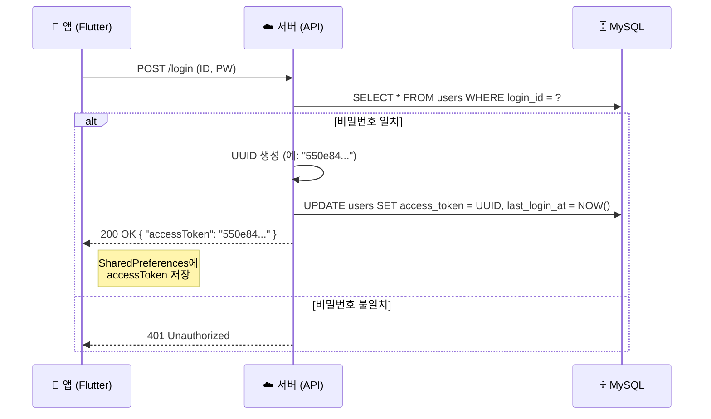
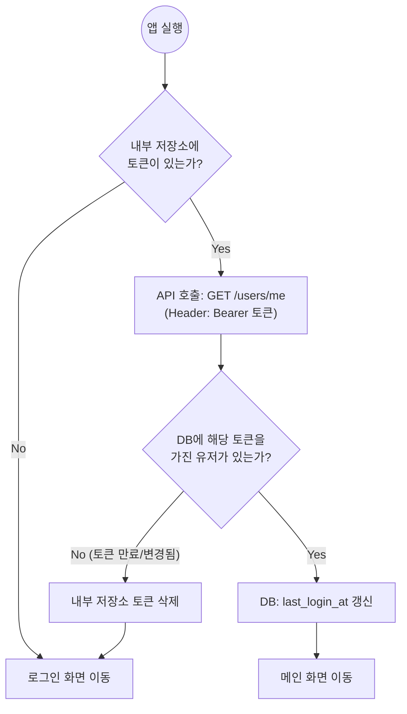
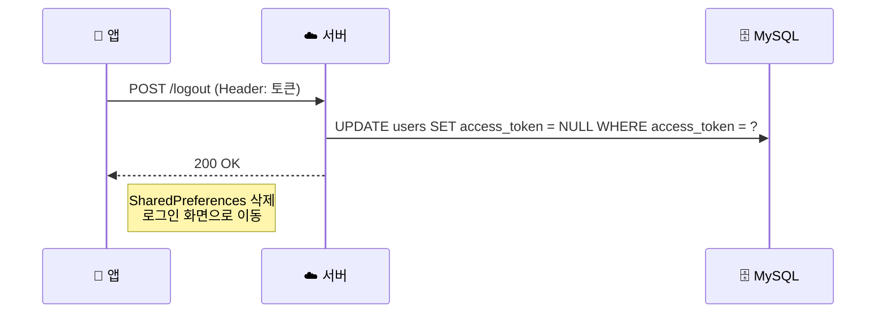

# [설계] 인증 시스템 아키텍처 및 구현 가이드 (UUID Stateful Token)

> **문서 번호:** 06_auth_architecture_spec.md  
> **작성 일자:** 2025.01.10  
> **설계 목적:** 복잡한 JWT 없이, **MySQL DB 기반의 세션 토큰**을 사용하여 직관적이고 강력한(강제 로그아웃 가능) 인증 시스템 구현.  
> **전제 조건:** 로컬 DB(SQLite)를 사용하지 않으며, **서버 DB가 유일한 진실 공급원(Single Source of Truth)**이다.  

---

## 1. 개요 (Overview)

본 프로젝트는 **Stateful Session** 방식을 채택한다.
사용자가 로그인하면 서버는 **고유한 랜덤 문자열(UUID)**을 생성하여 DB에 저장하고, 클라이언트에게 발급한다. 이후 모든 요청 헤더에 이 토큰을 실어 보내면, 서버는 DB를 조회하여 사용자를 식별한다.

### 1.1 채택 사유
1.  **구현의 단순성:** 암호화 알고리즘이나 서명 검증 로직이 필요 없음.
2.  **확실한 제어권:** 관리자가 특정 사용자의 DB 토큰 값을 지우거나 바꾸면, 해당 사용자는 **즉시 강제 로그아웃** 처리됨.
3.  **단일 DB 의존:** 별도의 Redis나 캐시 서버 없이 MySQL 하나로 처리하여 인프라 비용 절감.

---

## 2. 데이터베이스 설계 (Database Schema)

기존 `USERS` 테이블에 인증 관련 컬럼을 추가한다.

### 2.1 USERS 테이블 변경 스크립트
```sql
ALTER TABLE users ADD COLUMN access_token VARCHAR(64) NULL;
ALTER TABLE users ADD COLUMN last_login_at TIMESTAMP NULL;

-- 성능을 위해 인덱스 추가 권장
CREATE INDEX idx_users_access_token ON users(access_token);
```

### 2.2 컬럼 명세
| 컬럼명 | 타입 | 설명 |
| :--- | :--- | :--- |
| **access_token** | VARCHAR(64) | 로그인 성공 시 생성된 UUID 저장. (API 요청 시 식별자로 사용) |
| **last_login_at** | TIMESTAMP | 마지막으로 토큰이 발급/사용된 시간. (만료 체크용) |

---

## 3. 인증 프로세스 워크플로우 (Workflow)

### 3.1 로그인 및 토큰 발급 (Login)



### 3.2 자동 로그인 및 유효성 검사 (Auto Login)
앱 실행 시(Splash Screen) 수행되는 로직입니다.



### 3.3 로그아웃 (Logout)



---

## 4. 구현 가이드 (Implementation)

### 4.1 서버 사이드 (Backend Logic)
* **토큰 생성:** UUID v4 표준을 사용한다.
* **인증 미들웨어 (Auth Middleware):**
    * 모든 보안 API 요청에 대해 HTTP Header의 `Authorization: Bearer {UUID}`를 파싱한다.
    * `SELECT * FROM users WHERE access_token = '{UUID}'` 쿼리를 실행한다.
    * 결과가 없으면 `401 Unauthorized`를 리턴한다.

### 4.2 클라이언트 사이드 (Flutter Logic)
앱은 **SharedPreferences**를 사용하여 토큰을 영구 저장합니다.

```dart
import 'package:shared_preferences/shared_preferences.dart';
import 'package:http/http.dart' as http;

class AuthService {
  static const String _tokenKey = 'auth_token';
  static const String _baseUrl = 'http://your-server-ip:8080';

  // 1. 로그인
  Future<bool> login(String id, String pw) async {
    final response = await http.post(
      Uri.parse('$_baseUrl/login'),
      body: {'id': id, 'password': pw},
    );

    if (response.statusCode == 200) {
      // 서버에서 받은 UUID 추출 (JSON 파싱 필요)
      // 예: Map<String, dynamic> body = jsonDecode(response.body);
      String token = "SERVER_GENERATED_UUID"; // body['accessToken']; 
      
      // 내부 저장소에 저장
      final prefs = await SharedPreferences.getInstance();
      await prefs.setString(_tokenKey, token);
      return true;
    }
    return false;
  }

  // 2. 자동 로그인 체크 (앱 시작 시 호출)
  Future<bool> checkAutoLogin() async {
    final prefs = await SharedPreferences.getInstance();
    final String? token = prefs.getString(_tokenKey);

    if (token == null) return false;

    // 서버에 유효성 검증 요청
    final response = await http.get(
      Uri.parse('$_baseUrl/users/me'),
      headers: {'Authorization': 'Bearer $token'},
    );

    if (response.statusCode == 200) {
      return true; // 유효함 -> 메인으로
    } else {
      await prefs.remove(_tokenKey); // 만료됨 -> 지우고 로그인으로
      return false;
    }
  }

  // 3. 로그아웃
  Future<void> logout() async {
    final prefs = await SharedPreferences.getInstance();
    String? token = prefs.getString(_tokenKey);
    
    if (token != null) {
        // 서버에 로그아웃 알림 (DB 토큰 삭제 요청)
        await http.post(
            Uri.parse('$_baseUrl/logout'),
            headers: {'Authorization': 'Bearer $token'},
        );
    }
    await prefs.remove(_tokenKey);
  }
}
```

---

## 5. 보안 및 운영 고려사항

1.  **HTTPS 사용 필수:** 토큰이 `Bearer` 헤더에 평문으로 전송되므로, SSL(HTTPS)을 적용하지 않으면 토큰 탈취 위험이 있음. (개발 단계에선 HTTP 허용)
2.  **토큰 만료 정책 (Expiration):**
    * DB의 `last_login_at`을 활용하여, 마지막 접속일로부터 30일이 지난 토큰은 서버에서 거부하고 삭제하도록 스케줄링(Batch) 가능.
3.  **동시 로그인 정책:**
    * 현재 로직은 한 ID로 새 기기에서 로그인하면, 기존 기기의 토큰이 덮어씌워지므로 **기존 기기는 자동 로그아웃** 됨. (단일 기기 로그인 정책 자동 적용)

---

## 6. 참고 자료 (References)

본 아키텍처 수립에 참고한 핵심 자료입니다.

1.  **[YouTube] Flutter 상태 관리와 로컬 DB 없는 구조**
    * 설명: 로컬 DB(SQLite) 없이 서버 API와 상태 관리만으로 앱을 구성하는 'Thin Client' 아키텍처에 대한 개념 설명.
    * 링크: [플러터 앱의 상태 관리와 아키텍처 (Click)](https://www.youtube.com/watch?v=t3CF4i902I8)

2.  **[Docs] SharedPreferences (Flutter Package)**
    * 설명: 간단한 키-값(Key-Value) 쌍을 디바이스에 영구 저장하는 패키지 가이드.
    * 링크: [pub.dev/packages/shared_preferences](https://pub.dev/packages/shared_preferences)

3.  **[Docs] MySQL UUID Reference**
    * 설명: MySQL에서 UUID를 생성하고 관리하는 방법에 대한 공식 문서.
    * 링크: [MySQL 8.0 Reference - UUID](https://dev.mysql.com/doc/refman/8.0/en/miscellaneous-functions.html#function_uuid)