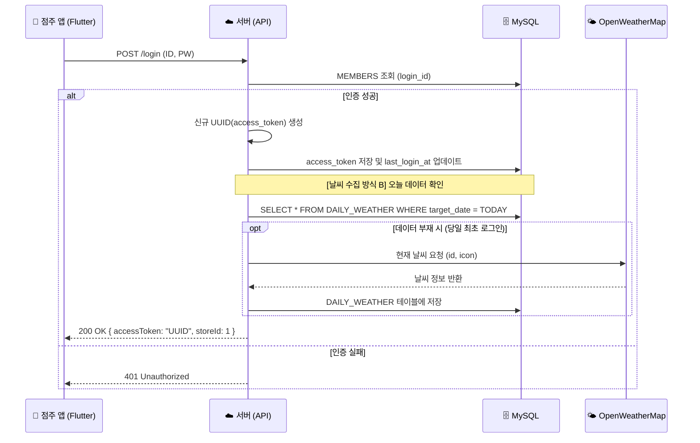

# [설계] 인증 시스템 아키텍처 및 구현 가이드 (v4.0)

> - **문서 번호:** 06_auth_architecture_spec.md. 
> - **작성 일자:** 2026.01.12. 
> - **버전:** v4.0 (Full Integration: 날씨 트리거 및 기기 보안 강화). 
> - **설계 목적:** JWT의 복잡성 없이 **MySQL DB 기반의 세션 토큰(UUID)**을 사용하여 강력한 제어권과 날씨 데이터 수집 기능을 통합한 인증 시스템 구현.  

---

## 1. 개요 (Overview)

본 프로젝트는 **Stateful Session** 방식을 채택한다. 점주가 로그인하면 서버는 고유한 랜덤 문자열(UUID)을 생성하여 DB에 저장하고 클라이언트에게 발급한다. 특히, 로그인 성공 시점은 당일 매장 운영에 필요한 **날씨 정보를 수집(방식 B)**하는 중요한 트리거로 활용된다.

### 1.1 채택 사유
1. **단순성 및 보안:** 암호화 알고리즘 없이 UUID 비교만으로 인증하며, 서버에서 토큰 삭제 시 즉시 강제 로그아웃이 가능하다.
2. **날씨 동기화:** 점주가 앱을 켜는 행위를 '영업 개시'로 간주하여 데이터 수집 비용을 최적화한다.
3. **기기 모드 보호:** 공용 태블릿(테이블/대기용)에서 점주 모드로 이탈하는 것을 방지하는 PIN 인증 체계를 포함한다.

---

## 2. 데이터베이스 설계 (Database Schema)

07번 명세서의 `MEMBERS` 테이블을 기준으로 인증 필드를 구성한다.

### 2.1 MEMBERS 테이블 인증 필드

| 컬럼명 | 타입 | 설명 |
| :--- | :--- | :--- |
| **access_token** | VARCHAR(64) | 로그인 성공 시 생성된 UUID v4 (API 요청 헤더에 Bearer로 포함) |
| **last_login_at** | TIMESTAMP | 마지막 세션 갱신 시간 (일일 날씨 수집 여부 판단의 기준) |

---

## 3. 인증 프로세스 및 비즈니스 트리거 (Workflow)

### 3.1 로그인 및 날씨 수집 시퀀스 (Method B)



---

## 4. 기기 운영 모드 보안 (Device Mode Security)

점주 앱에서 [테이블 주문 모드]나 [대기 등록 모드]로 전환된 태블릿은 일반 손님에게 노출되므로, 관리 화면으로의 무단 진입을 막는 별도의 보안 로직이 필요하다.

1. **인증 유지:** 점주의 `access_token` 권한을 세션에 유지하여 주문/대기 접수 API를 호출할 수 있게 한다.
2. **모드 이탈 차단:** 특정 제스처(예: 로고 5회 터치) 수행 시 비밀번호 입력창을 노출한다.
3. **PIN 검증:** `STORE_TABLES.auth_code`와 대조하여 일치할 경우에만 점주 메인 화면(`O-01`)으로 복귀시킨다.

---

## 5. 구현 가이드 (Client-side)

### 5.1 인증 인터셉터 및 날씨 처리 (Dart 예시)

```dart
// API 요청 시 헤더에 토큰 자동 포함
Future<Map<String, String>> getHeaders() async {
  final prefs = await SharedPreferences.getInstance();
  final token = prefs.getString('access_token');
  return {
    'Authorization': 'Bearer $token',
    'Content-Type': 'application/json',
  };
}

// 로그인 성공 후 처리
if (response.statusCode == 200) {
  saveToken(response.data['accessToken']);
  // 서버에서 날씨 수집이 완료되었으므로 대시보드 진입 시 최신 날씨 바로 로드 가능
  navigateToDashboard();
}
```

---

## 6. 참고 자료 (References)

본 아키텍처 수립에 참고한 핵심 자료입니다.

1. **[YouTube] Flutter 상태 관리와 로컬 DB 없는 구조**
    * 설명: 로컬 DB(SQLite) 없이 서버 API와 상태 관리만으로 앱을 구성하는 'Thin Client' 아키텍처 개념 설명.
    * 링크: [플러터 앱의 상태 관리와 아키텍처 (Click)](https://www.youtube.com/watch?v=t3CF4i902I8)

2. **[Docs] SharedPreferences (Flutter Package)**
    * 설명: 인증 토큰 및 기기 설정값을 영구 저장하기 위한 패키지 가이드.
    * 링크: [pub.dev/packages/shared_preferences](https://pub.dev/packages/shared_preferences)

3. **[Docs] MySQL UUID Reference**
    * 설명: MySQL에서 안전한 고유 식별자(UUID)를 생성하고 관리하는 방법.
    * 링크: [MySQL 8.0 Reference - UUID](https://dev.mysql.com/doc/refman/8.0/en/miscellaneous-functions.html#function_uuid)

---
